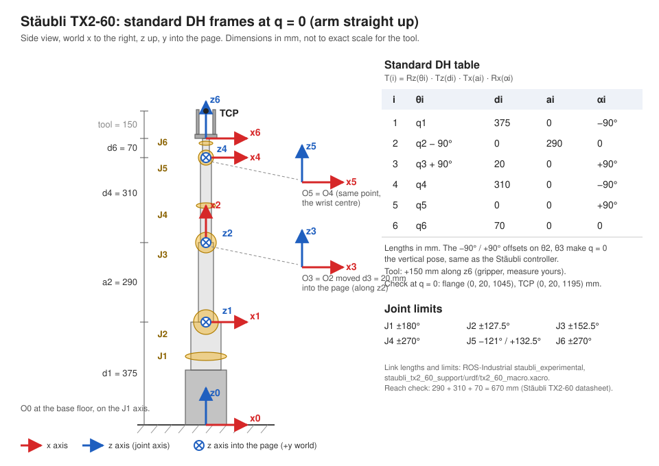

# Stäubli TX2-60: DH parameters

Hand-drawn full DH diagram: `dh_full_diagram.jpg` (to be added).

Reference frame diagram:



## Link dimensions

| Symbol | Value | Meaning |
|---|---|---|
| d1 | 375 mm | base floor to the shoulder (J2) axis |
| a2 | 290 mm | shoulder (J2) to elbow (J3), upper arm |
| d3 | 20 mm | sideways offset between J2 and J3, along the J2 axis |
| d4 | 310 mm | elbow (J3) to wrist centre (J5), forearm |
| d6 | 70 mm | wrist centre to tool flange |

Sanity check: a2 + d4 + d6 = 290 + 310 + 70 = **670 mm**, which is the reach Stäubli publishes for the TX2-60 [2][3].

## Standard DH table (used by the code)

T<sub>i</sub> = Rz(θ<sub>i</sub>) · Tz(d<sub>i</sub>) · Tx(a<sub>i</sub>) · Rx(α<sub>i</sub>)

| i | θ<sub>i</sub> | d<sub>i</sub> (m) | a<sub>i</sub> (m) | α<sub>i</sub> | Joint limits [1] |
|---|---|---|---|---|---|
| 1 | q1 | 0.375 | 0 | −π/2 | ±180° |
| 2 | q2 − π/2 | 0 | 0.290 | 0 | ±127.5° |
| 3 | q3 + π/2 | 0.020 | 0 | +π/2 | ±152.5° |
| 4 | q4 | 0.310 | 0 | −π/2 | ±270° |
| 5 | q5 | 0 | 0 | +π/2 | −121° / +132.5° |
| 6 | q6 | 0.070 | 0 | 0 | ±270° |

Tool: `SE3(0, 0, 0.15)` for a 150 mm gripper. The fingers have to reach past the centre of the widest pot (160 mm) and open to 170 mm. Measure yours and change `GRIPPER_LENGTH` / `FINGER_OFFSET` in `models/staubli_tx2_60.py`.

The −π/2 and +π/2 offsets on joints 2 and 3 make **q = 0 the arm standing straight up**. That's the Stäubli zero position, so the angles in the sim match the teach pendant.

### Modified DH (Craig), if your course uses that convention

T<sub>i</sub> = Rx(α<sub>i−1</sub>) · Tx(a<sub>i−1</sub>) · Rz(θ<sub>i</sub>) · Tz(d<sub>i</sub>)

| i | α<sub>i−1</sub> | a<sub>i−1</sub> (m) | d<sub>i</sub> (m) | θ<sub>i</sub> |
|---|---|---|---|---|
| 1 | 0 | 0 | 0.375 | q1 |
| 2 | −π/2 | 0 | 0 | q2 − π/2 |
| 3 | 0 | 0.290 | 0.020 | q3 + π/2 |
| 4 | +π/2 | 0 | 0.310 | q4 |
| 5 | −π/2 | 0 | 0 | q5 |
| 6 | +π/2 | 0 | 0 | q6 |

In MDH, frame 6 sits at the wrist centre, so the tool is `SE3(0, 0, 0.070 + gripper)`. `python models/staubli_tx2_60.py` checks that the standard DH, MDH and Swift models all give the same pose.

## Frames at q = 0 (for drawing the diagram)

World: x to the right, y into the page, z up. Positions are in mm.

| Frame | Origin (x, y, z) | z axis | x axis |
|---|---|---|---|
| 0 | (0, 0, 0) | up (J1) | right |
| 1 | (0, 0, 375) | into page (J2) | right |
| 2 | (0, 0, 665) | into page (J3) | up |
| 3 | (0, 20, 665) | up (J4) | right |
| 4 | (0, 20, 975) | into page (J5) | right |
| 5 | (0, 20, 975) | up (J6) | right |
| 6 (flange) | (0, 20, 1045) | up | right |
| TCP | (0, 20, 1195) | up | right |

## How to draw it yourself

1. **Draw the arm at q = 0**, standing straight up, side-on. Do the whole diagram in this one pose; it's the easiest pose to read.
2. **Mark the six joint axes.** J1, J4 and J6 run up along the arm, so draw them as small rings around the link. J2, J3 and J5 point into the page, so draw them as circles.
3. **Draw z<sub>i−1</sub> along joint i's axis.** z0 = J1 (up), z1 = J2 (⊗), z2 = J3 (⊗), z3 = J4 (up), z4 = J5 (⊗), z5 = J6 (up). Then z6 goes out of the flange.
4. **Place each origin** where the common normal between z<sub>i−1</sub> and z<sub>i</sub> meets z<sub>i</sub>. Use the origin table above. O2/O3 and O4/O5 land on the same (or almost the same) point, so draw one of each pair slightly off to the side with a dashed leader line, as in the reference diagram.
5. **Draw x<sub>i</sub> along the common normal**, pointing from z<sub>i−1</sub> towards z<sub>i</sub>. Where the z axes are parallel or they intersect, pick a direction and keep it consistent. Here every x points to the right, except x2, which points up along the upper arm (a2 is measured along it).
6. **You don't need to draw y.** It's always z × x.
7. **Dimension the link lengths** (375, 290, 20, 310, 70) and add the tool offset.
8. **Put the DH table next to the drawing.** State which convention you used (standard vs modified) and that q = 0 is the vertical pose.

Check your drawing against the numbers. Reading down the table:
- α<sub>i</sub> is the angle from z<sub>i−1</sub> to z<sub>i</sub> about x<sub>i</sub>.
- a<sub>i</sub> is the distance between them along x<sub>i</sub>.
- d<sub>i</sub> is the distance along z<sub>i−1</sub>.
- θ<sub>i</sub> is the angle from x<sub>i−1</sub> to x<sub>i</sub> about z<sub>i−1</sub>.

## Checking the numbers

| q (deg) | Expected TCP (m), base frame |
|---|---|
| 0, 0, 0, 0, 0, 0 | (0, 0.020, 1.195) |
| 0, 0, 90, 0, 0, 0 | (0.530, 0.020, 0.665) |

## Running the model and sim

From the repo root:

```bash
pip install -r requirements.txt
python models/staubli_tx2_60.py                      # DH table + DH/MDH/Swift model check
python Jayden-Bot/sim/swift_scene_setup.py          # view the scene
python Jayden-Bot/sim/Selfcare_sequence.py --headless --moisture 10   # plan every move, no browser
python Jayden-Bot/sim/Selfcare_sequence.py --moisture 10              # full run in Swift, 5x speed
python Jayden-Bot/sim/Selfcare_sequence.py --moisture 10 --speed 1    # real time
```

`Jayden-Bot/` holds working copies of the files from the `jaydenrebot-model` branch (`models/rebot_b601_dm.py`, `sim/`). They're kept here so changes on this branch don't touch his. If he wants the changes, he copies them into his `models/` and `sim/` folders, along with `models/staubli_tx2_60.py`. `sim/collision.py` is new: every planned move is checked against the furniture, pots, can and the other arm before either arm moves.

## Sources

1. ROS-Industrial, *staubli_experimental*, `staubli_tx2_60_support/urdf/tx2_60_macro.xacro`: joint origins, joint limits and joint speeds. https://github.com/ros-industrial/staubli_experimental
2. Stäubli, *TX2-60 6-axis industrial robot* product page (reach 670 mm). https://www.staubli.com/global/en/robotics/products/industrial-robots/6-axis/tx2-60.html
3. RoboDK, *Staubli TX2-60* robot library entry (reach 670 mm, repeatability 0.02 mm). https://robodk.com/robot/Staubli/TX2-60
4. J. Denavit and R. S. Hartenberg, "A kinematic notation for lower-pair mechanisms based on matrices," *ASME Journal of Applied Mechanics*, 22, pp. 215–221, 1955.
5. P. Corke, *Robotics, Vision and Control: Fundamental Algorithms in Python*, 3rd ed., Springer, 2023. Covers the DH/MDH conventions and the Robotics Toolbox for Python.

For the final report, check the joint limits against the Stäubli TX2-60 instruction manual or datasheet from your lab. The values here come from the ROS-Industrial URDF [1].
